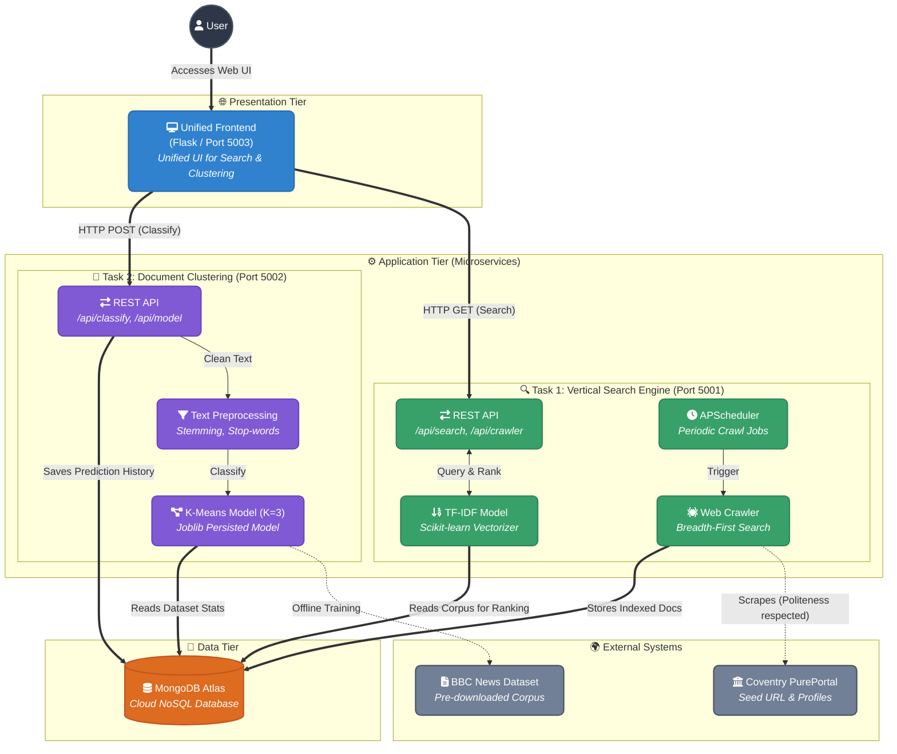

<div align="center">
  <h1>🔍 Information Retrieval System</h1>
  <p><b>ST7071CEM Coursework — Coventry University & Softwarica</b></p>

  <!-- Badges -->
  <p>
    
    
    
    
  </p>

  <p>
    <a href="http://www.onespotsearch.linkpc.net/"><strong>🌐 Live Demo (Link 1)</strong></a> •
    <a href="http://unified-frontend-6qge.onrender.com/"><strong>🌐 Live Demo (Link 2)</strong></a> •
    <a href="https://github.com/jrohitofficial/IR-Search-Engine.git"><strong>🐙 GitHub Repository</strong></a> •
    <a href="#"><strong>🎥 Video Presentation (Link Here)</strong></a>
  </p>
</div>

---

## 📖 About The Project

This repository contains two working systems built for the **ST7071CEM Information Retrieval** coursework. Both systems operate independently via Flask backends but are brought together under a **Single Unified Frontend**.

### ✨ Core Features

*   **Task 1 — Vertical Search Engine:** Crawls Coventry University's PurePortal for the *Centre for Healthcare and Community Transformation*. It indexes research outputs using a **TF-IDF Vector Space Model** and serves ranked, paginated results featuring clickable links to original publications and author profiles.
*   **Task 2 — Document Clustering:** Clusters a 540-document *Economics / Entertainment / Politics* corpus using **K-Means (K=3)**. It classifies new user-submitted text against the trained model in real-time, storing all predictions in MongoDB.

> **Scope Note:** This project targets the *official* coursework brief (`ST7071CEM_InformationRetrieval_Coursework.pdf`). A full evidence pack (real code listings, screenshots, training output, and APA 7 references) is available in [`documentation/final_documentation.docx`](documentation/final_documentation.docx). Sections requiring the student's own critical analysis are marked **"AUTHOR ANALYSIS REQUIRED"**.

## 💡 Conceptual Diagram


---

## 🏗️ System Architecture



<details>
<summary><b>📂 View Directory Structure</b></summary>

```text
IR_COURSEWORK/
├── task1_vertical_search/
│   └── backend/          Flask app: crawler, TF-IDF ranking, scheduler, API, UI
├── task2_document_clustering/
│   ├── backend/           Flask app: preprocessing, K-Means, API, UI
│   ├── dataset/            raw + processed corpus
│   └── scripts/           build_dataset.py, train_model.py
├── documentation/
│   └── figures/            generated evaluation charts
├── .env.example
└── .gitignore
```
</details>

---

## 🚀 Getting Started

### Prerequisites

- **Python 3.11+** (developed and tested on 3.14)
- A **MongoDB Atlas** cluster (or any reachable MongoDB instance)
- **Internet access** (Task 1 crawls the live pureportal site; Task 2's dataset build reads a local archive).

### Installation

Clone the repository and run the following in your terminal:

```powershell
cd IR_COURSEWORK
python -m venv .venv
.venv\Scripts\Activate.ps1
pip install -r task1_vertical_search\backend\requirements.txt
pip install -r task2_document_clustering\backend\requirements.txt
```

> **Note:** The two requirement files overlap. Installing both into the same virtual environment is the simplest option and was used to build and test this project.

### Configuration

Copy `.env.example` to `.env` in the project root and fill in your real connection string:

```env
MONGODB_URI=mongodb+srv://<username>:<password>@<cluster-host>/?retryWrites=true&w=majority
DATABASE_NAME=ir_coursework
```
*(Both backends read this same `.env` file from the project root. Never commit the real `.env` file.)*

<details>
<summary><b>🛠️ Environment Variables Reference</b></summary>

| Variable | Meaning | Default |
|---|---|---|
| `MONGODB_URI` | MongoDB Atlas connection string | — |
| `SEED_URL` | Task 1 crawl seed | pureportal org URL |
| `CRAWL_INTERVAL_MONTHS` | How often the scheduler re-crawls | `3` |
| `MAX_PUBLICATIONS`, `MAX_PROFILES`, `MAX_CRAWL_SECONDS` | Crawl bounds | `200` / `200` / `1800` |
| `MIN_DOCS_PER_CATEGORY` | Task 2 dataset validation threshold | `150` |

</details>

---

## 💻 Running The Application

The application consists of three separate services that need to run simultaneously. Open **three separate terminal windows/tabs**, activate the virtual environment in each (`.venv\Scripts\activate`), and run:

| Terminal | Service | Command to Run | Port |
|:---:|---|---|:---:|
| **1** | Task 1 Backend | `cd task1_vertical_search\backend`<br>`python run.py` | `:5001` |
| **2** | Task 2 Backend | `cd task2_document_clustering\backend`<br>`python run.py` | `:5002` |
| **3** | Unified Frontend | `cd unified_frontend`<br>`python app.py` | `:5003` |

> ⚠️ **Note for Task 2:** If you haven't trained the dataset yet, run `python build_dataset.py` and `python train_model.py` in `task2_document_clustering/scripts` first.

Once all three services are running, open your web browser and navigate to **http://localhost:5003**.

---

## 🔍 Task 1 — Vertical Search Engine

**To run a single crawl (populates MongoDB):**
```powershell
cd task1_vertical_search\backend
python run.py --crawl
```

### Technical Highlights
*   **Crawler Design:** Uses a breadth-first search over the citation/co-authorship graph. Bypasses Cloudflare 403s on listing pages by parsing genuine, verifiable embedded widget links. Respects `robots.txt` and `Crawl-Delay: 5`.
*   **Scheduler:** Built with APScheduler's `BackgroundScheduler`. Fully configurable via `CRAWL_INTERVAL_MONTHS` in `.env`.
*   **Ranking (VSM):** Builds a TF-IDF matrix over all indexed documents using `scikit-learn TfidfVectorizer`. Ranks by cosine similarity and paginates at `TOP_K = 10`.

<details>
<summary><b>🔌 REST API Endpoints</b></summary>

| Method | Endpoint | Purpose |
|---|---|---|
| GET | `/api/search?q=...&page=1` | Ranked search, 10 results/page |
| GET | `/api/research-output/<id>` | Full stored record for one publication |
| GET | `/api/profile/<id>` | Full stored record for one profile |
| GET | `/api/crawler/status` | Last crawl stats, document counts, scheduler status |
| POST | `/api/crawler/run` | Trigger a crawl synchronously and rebuild the index |
</details>

**Run Tests:**
```powershell
cd task1_vertical_search\backend
pytest -v
```

---

## 🧠 Task 2 — Document Clustering

**To build the dataset and train the model:**
```powershell
cd task2_document_clustering\scripts
python build_dataset.py     # validates >=150/category, loads 540 docs into MongoDB
python train_model.py       # TF-IDF + K-Means(K=3), evaluation, PCA visualisation
```

### Technical Highlights
*   **Dataset:** Uses the Greene & Cunningham BBC News dataset (avoids live scraping of bbc.co.uk which explicitly forbids scraping for ML). The "business" category represents "Economics".
*   **Pipeline:** Clean → Lowercase → Tokenise → Punctuation/Stop-word Removal → Porter Stemming.
*   **Clustering:** `joblib` persisted TF-IDF → K-Means (K=3, k-means++ init, n_init=10) → majority-vote cluster mapping.

<details>
<summary><b>🔌 REST API Endpoints</b></summary>

| Method | Endpoint | Purpose |
|---|---|---|
| POST | `/api/classify` | Classify submitted text, save the prediction to MongoDB |
| GET | `/api/dataset/stats` | Per-category document counts vs. the 150/category minimum |
| GET | `/api/model/evaluation` | Silhouette score, inertia, confusion matrix, accuracy/F1 |
| GET | `/api/predictions/history` | Recent classifications |
</details>

**Run Tests:**
```powershell
cd task2_document_clustering\backend
pytest -v
```

---

## 🧪 Testing Dataset Triggers

Below are quick text snippets you can copy-paste into the classifier to test the K-Means model's accuracy:

| Category | Keywords / Triggers | Sample Text |
| :---: | :--- | :--- |
| 🏛️ **Politics** | `labour`, `party`, `election`, `blair`, `government`, `mp`, `tax`, `law` | *"The Labour party has announced a new election plan to increase public tax. Prime Minister Tony Blair told the government to pass a new law."* |
| 📈 **Economics** | `bank`, `market`, `price`, `economic`, `growth`, `company`, `shares`, `sales` | *"The central bank increased interest rates to control market prices and boost economic growth. The company reported record sales."* |
| 🎬 **Entertainment** | `film`, `oscar`, `director`, `actor`, `band`, `song`, `tv`, `music`, `album` | *"The new film won the Oscar for best director and best actor. The famous band performed their new song live on TV."* |

---

## 🆘 Troubleshooting

*   **`robots.txt disallows crawling` for a URL that should be allowed:** Make sure you're using the fixed `crawler/robots_check.py`, which fetches `robots.txt` with a browser User-Agent. Python's `RobotFileParser.read()` uses no custom headers and gets a 403 from Cloudflare.
*   **MongoDB connection timeout:** Check `MONGODB_URI` in `.env` and ensure your current IP is allow-listed in Atlas's Network Access settings.
*   **Task 2 `/api/classify` returns 503:** The model hasn't been trained yet; run `scripts/train_model.py`.